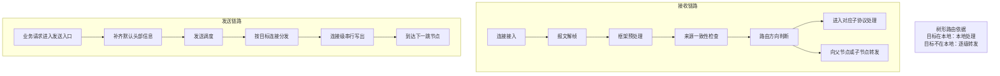

# 图3-3 重绘说明

## 建议标题

图3-3 树形路由中的接收与发送协同示意图

如果希望继续沿用原题目，也可以保留为：

图3-3 树形路由与逐级转发示意图

## 重绘目标

- 接收链路和发送链路分成上下两行
- 不出现具体代码函数名
- 强调“框架先判断，再决定本地处理或逐级转发”
- 强调“发送侧统一入口、统一补头、按连接顺序写出”

## 推荐布局

整张图采用横向双泳道布局：

- 上方一行：接收链路
- 下方一行：发送链路
- 中间可加一个竖向提示框，写“树形路由判断”

## 图中文字建议

### 第一行：接收链路

`连接接入`
→ `报文解帧`
→ `框架预处理`
→ `来源一致性检查`
→ `路由方向判断`
→ `本地处理或逐级转发`

其中“本地处理或逐级转发”可以再拆成两个并列小框：

- `进入对应子协议处理`
- `向父节点或子节点转发`

### 第二行：发送链路

`业务请求进入发送入口`
→ `补齐默认头部信息`
→ `发送调度`
→ `按目标连接分发`
→ `连接级串行写出`
→ `到达下一跳节点`

## 中间提示框建议

可在两行中间放一个较小的说明框：

`树形路由依据`

下面写两行小字：

- `目标在本地：交由本地处理`
- `目标不在本地：沿树形结构逐级转发`

## 推荐线框稿

## 手绘时注意

- 不要写 `selectHandler`、`sourceMismatch`、`conn.Pipe()` 这类实现细节
- 不要把这张图画成“完整代码流程图”，它应当是论文层面的机制示意图
- 接收和发送两行尽量等宽，风格保持统一
- 若版面较紧，可把中间提示框删掉，仅保留上下两行
