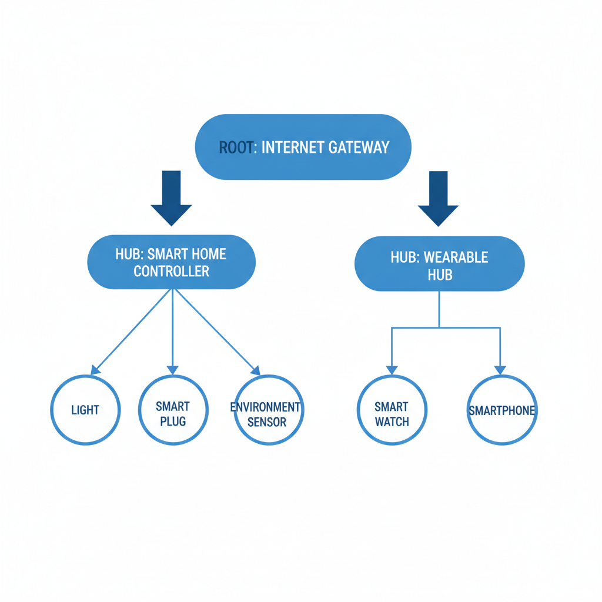
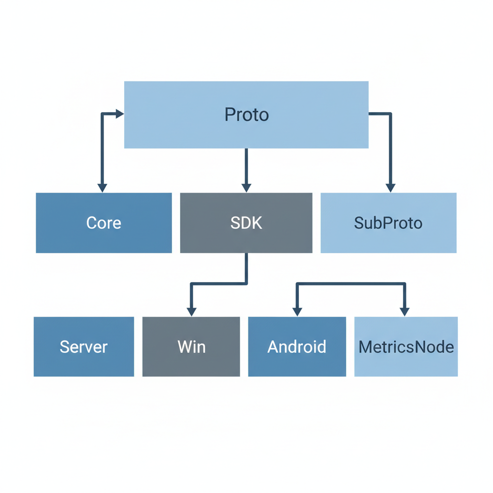
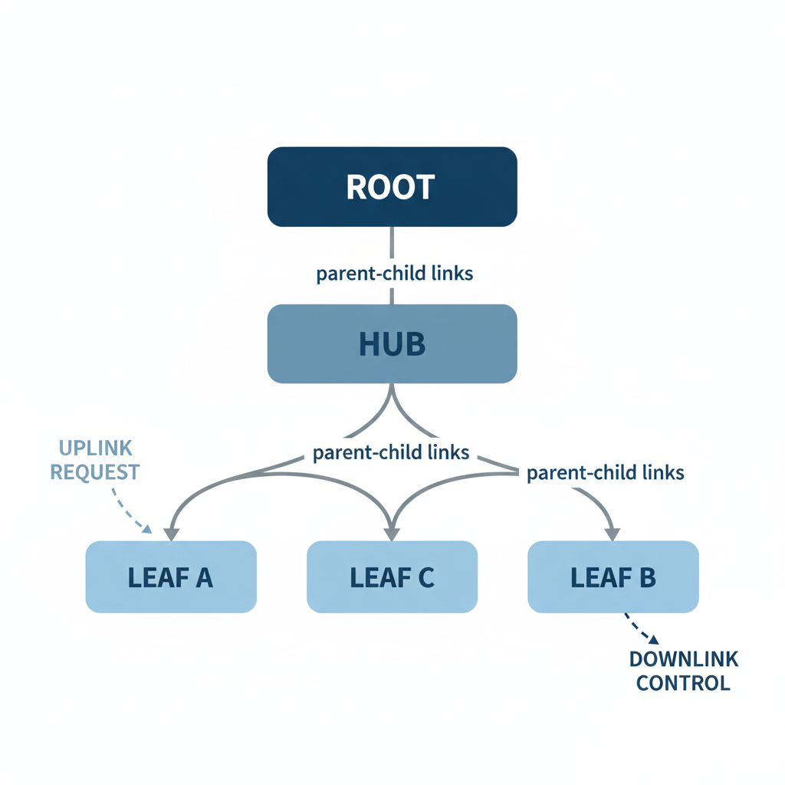
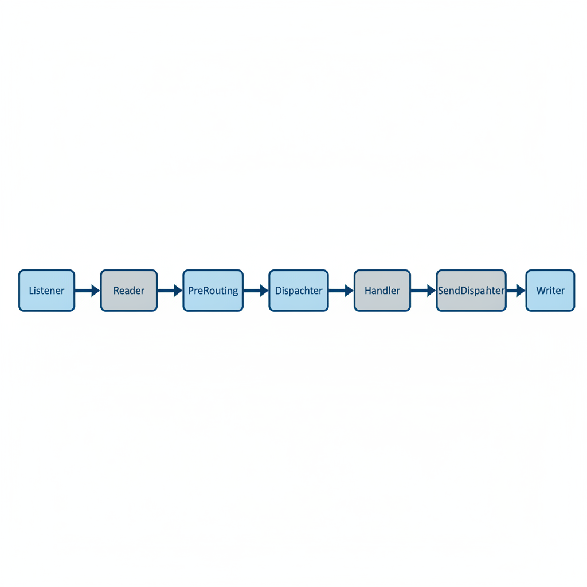
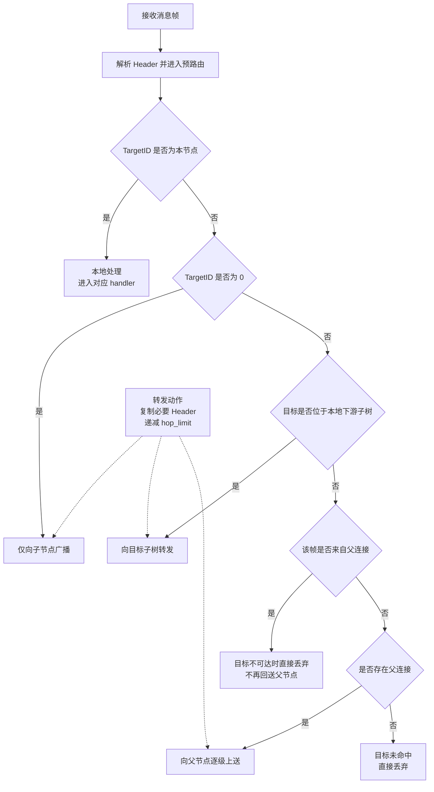
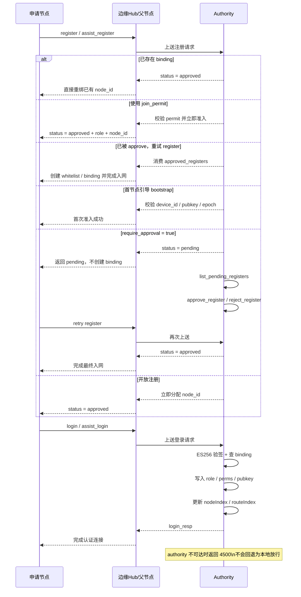
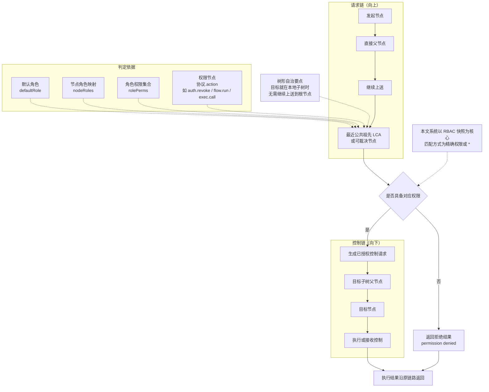
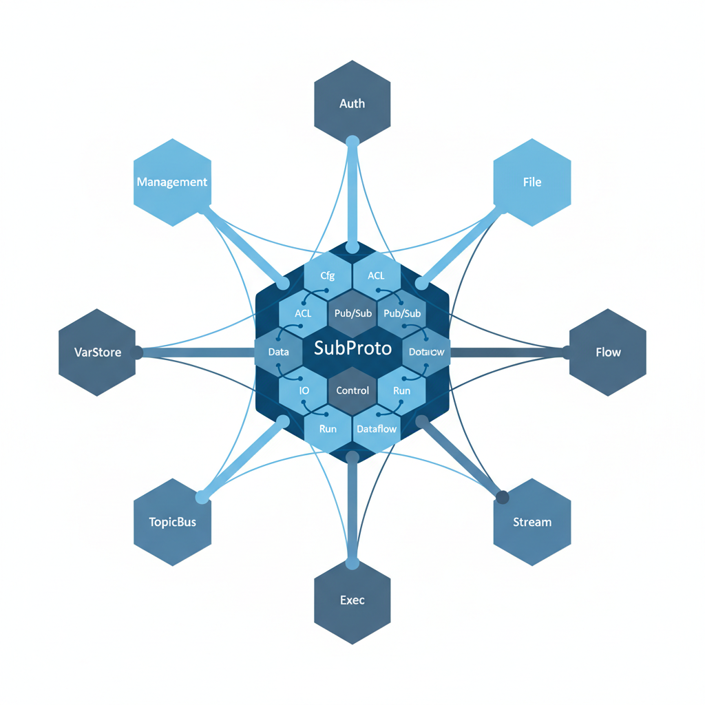
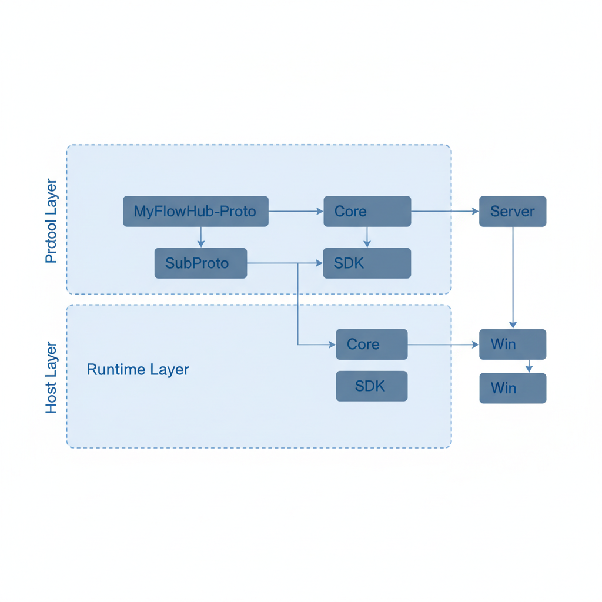
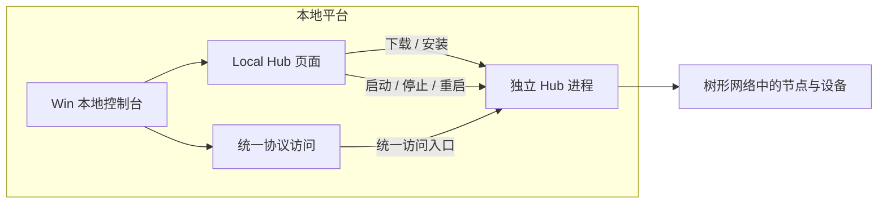

# 毕业论文（设计）

| 项目 | 内容 |
| --- | --- |
| 题目 | 基于树形拓扑的个人物联网消息中枢系统设计与实现 |
| 姓名 | 郑毅航 |
| 学号 | 32402436 |
| 专业班级 | 电子信息工程(专升本)2403班 |
| 所在学院 | 信息与电气工程学院 |
| 指导教师1（职称） | [待填写] |
| 指导教师2（职称） | [待填写] |
| 日期 | 二○二六年  月  日 |

## 中文摘要

本文围绕家庭、个人实验室等场景中的本地组网需求展开，关注的重点不是大规模云端接入，而是多房间、多节点条件下如何把设备稳定地组织起来。结合本文系统的实现情况，论文以统一节点模型为基础，讨论了树形拓扑下的路由方式、收发链路和子协议承载关系，并将 Auth、VarStore、TopicBus、File、Flow、Exec 等能力落到 Proto、Core、SDK、SubProto、Server、Win 的分层结构中。工程上，Win 通过 Local Hub 页面管理独立 Hub 进程，承担本地启动、节点接入与协议调试入口。从本文系统的实现结果看，该方案已经能够在不依赖固定云中心的前提下支持本地部署、逐层扩展和多节点协同，较适合个人物联网场景中对本地控制、扩展灵活性和后续能力增补的实际需求。

关键词：树形拓扑；个人物联网；消息中枢；树形路由；本地部署

## 英文摘要

Title: Design and Implementation of a Tree-Topology Personal IoT Message Hub System

This thesis focuses on local networking needs in scenarios such as homes and personal laboratories. Rather than targeting large-scale cloud access, it addresses how devices can be organized stably under multi-room and multi-node conditions. Based on the implementation presented in this thesis, it adopts a unified node model and discusses routing methods, message receiving and sending chains, and subprotocol hosting relationships under a tree topology. It further places capabilities such as Auth, VarStore, TopicBus, File, Flow, and Exec within the layered structure of Proto, Core, SDK, SubProto, Server, and Win. In the engineering implementation, Win manages an independent Hub process through the Local Hub page and serves as the entry for local startup, node access, and protocol debugging. According to the implementation results of the proposed system, the scheme can support local deployment, step-by-step expansion, and multi-node collaboration without relying on a fixed cloud center, and is therefore suitable for personal IoT scenarios that require local control, flexible extensibility, and subsequent capability expansion.

Keywords: tree topology; personal Internet of Things; message hub; tree-based routing; local deployment

## 目录


## 第1章 绪论

### 1.1 研究背景与意义

近几年，物联网应用的重心已经不只停留在工业现场和公共基础设施。对个人用户而言，更常见的反而是家庭、多房间工作室和小型实验环境。这样的场景规模不大，却往往分散：设备来源杂，网络条件并不总是理想，维护工作也多由使用者自己完成。因此，这类平台首先要解决的并不是海量接入，而是如何在本地把设备稳妥地连起来、管起来[1][2]。

如果仍把网络理解为所有节点直连一个中心，问题很快就会暴露出来。房间一多、楼层一多，或者中间出现弱网区域，覆盖和转发都会受到限制。已有研究说明，树形拓扑在层级路由、链路维护和网络延展方面更适合分层部署环境[3][5]。对个人物联网来说，这种结构的意义在于，它允许节点按父子关系逐层向外扩展，而不必把所有终端都强行压到同一个中心入口上。

与网络结构相对应，节点角色也不宜在设计之初就被固定死。一台桌面主机在某个场景里可能承担上层入口，换到另一套部署中也可能只是普通业务节点；某些边缘设备既能采集数据，也能在局部网络里承担转发任务。把设备统一抽象为可配置节点，更符合个人物联网场景中“设备能力不同，但接入逻辑尽量一致”的实际情况[4]。

另一个绕不过去的问题是控制边界。个人物联网虽然规模较小，但节点职责经常交叉，既有数据采集，也有文件收发、流程触发和能力调用。一旦缺少统一的身份确认与权限表达方式，多节点协同就很容易从“灵活”变成“混乱”。现有研究在 RBAC、ABAC 及其扩展模型上已经给出不少讨论[9][10][11]，但把这些模型直接照搬到本地、多跳、分层的个人网络里，往往还需要进一步取舍。

基于上述问题，本文并不试图构造一个面向云平台的大而全系统，而是围绕个人物联网中的本地消息中枢展开设计与实现。论文希望回答的是：在树形拓扑下，如何把节点接入、消息转发、权限控制和上层能力扩展组织成一套能够实际落地的方案，并使其可以继续沿着现有工程结构向后演进。

### 1.2 国内外研究现状

从现有文献看，与本文关系最紧的工作主要集中在三个方向：分层网络与边缘协同、异构协议接入以及身份认证和访问控制。先看第一类研究。周子恒提出的分层边缘计算模型表明，层级式资源分配有利于降低计算延迟并提升节点调度效率[4]；胡丽平、郭首江等围绕树形网络中的路由维护与带宽竞争展开讨论，指出树形结构在多级网络环境下具有较好的可维护性与扩展潜力[3][5]。这些成果说明，树形或分层网络并不是简单的结构变形，而是确实能够为多跳环境提供更清楚的组织方式。

第二类研究更多聚焦于异构设备如何接进同一平台。智能家居和边缘网关相关工作反复强调，真正困难的往往不是“接入成功”本身，而是接入之后能否继续在同一套语义下管理和协同。周犇围绕 Wi-Fi 与 ZigBee 的家庭网关进行了实现研究，说明网关能够在异构设备接入中承担桥接作用[2]；刘秉阳等则指出，协议碎片化仍是个人物联网应用中的突出问题[1]。同时，GB/T 46456.1-2025 对智能家居互联互通架构进行了规范化描述[7]。这些研究共同提示，协议支持若只停留在底层兼容，平台很难继续向上组织更复杂的控制与协作能力。

第三类研究集中在认证与访问控制。Díaz 和 Mendoza 对 IoT 授权模型进行了综述，指出角色模型、属性模型及其扩展各有适用边界[9]；Cheng 等与柳明蕊分别从多授权中心密文策略属性加密和属性加密访问控制角度，讨论了分布式与细粒度授权的可行路径[10][11]；王小芬、葛晶晶、王梅等则从设备认证、持续认证和低交互认证协议出发，研究了资源受限条件下如何提升身份可信度[13][14][15]。不过，这些成果多面向更一般化的 IoT 场景，若直接移植到本文所讨论的本地、多跳、树形网络中，仍需要结合部署方式和控制路径重新调整。

综合现有文献可以看到，网络结构、协议互通和安全机制等方面已经积累了较好基础，但与“个人物联网本地消息中枢”这一对象之间仍有距离。很多工作面向云平台、工业边缘或标准网关，关注重点与个人场景并不完全一致；通信框架、认证权限和扩展能力也常被分开讨论，缺少围绕同一树形拓扑组织起来的工程化表达。本文的工作，正是在这一缺口上结合本文系统的实现情况做进一步整理。

### 1.3 研究目标、研究内容与贡献点

本文希望完成的，并不是抽象提出一种全新的通用理论，而是结合现有项目，把适合个人物联网场景的树形消息中枢方案说明白、落下来。对应到系统目标上，就是在不依赖固定云中心的前提下，用统一节点抽象组织不同设备，使它们能够在多跳环境中完成接入、转发、控制和能力扩展。

围绕这一目标，论文的工作大体沿着“需求一机制一实现”展开。前面先把个人物联网在本地部署、多层空间和设备差异方面的实际问题说清；中间部分讨论统一消息头、收发链路、树形转发、来源校验以及权限控制这些核心机制；再往后，则把变量、事件、文件、流程和能力调用等子协议放回工程结构中，说明它们如何在现有分层体系里被组织和使用。

本文的主要贡献点可概括为以下三点。

1. 从个人物联网的本地部署与多跳协同需求出发，整理出统一节点抽象和树形组织方式，使节点角色可以随部署位置和运行能力变化，而不是在系统起点就被固定。
2. 结合本文系统的实现路径，说明了消息头、预处理、来源一致性校验和树形裁决如何共同构成通信与控制链路，使消息转发与权限判断不再彼此割裂。
3. 依托统一协议映射，梳理了认证、变量、主题、文件、流程和能力调用等子协议与工程分层之间的对应关系，明确了协议字典、核心框架、客户端能力、子协议实现、服务端装配和宿主应用各自承担的职责。

本文在“设计与实现”的表述上以本文系统的工程状态为依据。已经形成稳定运行路径的模块，按本文系统既有实现进行分析；仍带有“草案”性质、但已纳入统一协议体系和模块装配路径的部分，则重点说明其设计目标、接口约束和现阶段实现边界，而不将其表述为完全成熟的终态功能。因此，本文对实现边界与成熟程度作了区分说明。

### 1.4 技术路线与论文结构安排

本文的展开顺序基本对应这套系统从问题提出到工程落地的形成过程。前两章先回答“为什么需要这样一套本地消息中枢”以及“它要解决什么问题”，随后再进入核心通信机制、认证与权限、子协议组织和工程实现，最后回到结论与后续建议。按章节安排，第1章介绍研究背景、现状和研究目标；第2章说明场景、需求与总体方案；第3章分析核心通信框架和树形路由；第4章讨论身份认证与权限控制；第5章说明各子协议的职责边界；第6章结合本文系统介绍实现与部署形态；第7章给出全文结论，并说明尚存问题和后续研究建议。

## 第2章 需求分析与总体方案设计

### 2.1 典型应用场景与问题定义

个人物联网平台面对的往往不是标准化机房，而是家庭、个人实验室、小型工作室和轻量边缘环境。设备数量未必很多，但类型差异通常很大：既有桌面端和本地服务端，也可能同时接入传感器、执行器、屏显设备和临时节点。与企业级平台相比，这类场景更强调使用者可以自己在本地搭建、扩展和维护系统，因此平台应尽量减少对外部云中心的依赖。

以多房间场景为例，一台桌面主机可能放在书房，传感器位于另一间房间，某些执行设备则挂在局部边缘节点之后。若系统仍采用固定中心加星型接入的方式，一旦中心节点与远端设备之间出现覆盖盲区，就不得不额外增加桥接设备，甚至重构网络。这样一来，成本会上升，结构也会变得别扭。树形组织的好处正在于，它允许节点顺着父子关系自然向外扩展，在不依赖复杂全网广播的前提下完成多跳控制。



图2-1 个人物联网典型应用场景与树形组网示意图

基于这类场景，本文关心的问题主要落在三个层面：消息如何在统一头部语义下完成上报、转发、命中与回程，而不是在多跳过程中逐渐失去一致性；节点身份如何被确认，来源伪造如何被阻止，不同子树中的资源又如何在局部自治前提下受到控制；变量、事件、文件、流程和能力调用等上层功能能否复用同一条通信主线，而不是各自形成一套彼此割裂的链路。表面上看，这是几类问题；真正落到系统里，它们必须被一起解决。

### 2.2 功能需求

从本文系统的实现与使用入口看，系统最核心的功能可以概括为三组。第一组是节点准入与身份管理，包括注册、登录、凭据查询、审批准入、绑定撤销和离线通知等内容；第二组是拓扑与连接管理，涉及父链连接、子节点维护、节点信息读取、子树浏览和局部管理；第三组则是围绕业务能力展开的数据交换，如变量读写、主题发布与订阅、文件交互、远程能力调用以及基于 DAG 的流程编排。三组功能在论文中被分开描述，但在本文系统里始终彼此联动。

仅有协议定义还不够，用户还需要一个能直接操作系统的入口。就本文系统的宿主形态而言，Win 既可以连接已经运行的 Hub，也可以在本机完成 Local Hub 的下载、启动与状态管理。用户随后还能从同一宿主进入设备管理、变量查看、主题调试、文件交互、流程运行和访问策略等页面。因此，Win 在本文所讨论的系统中承担的是本地宿主与调试入口的角色，而不只是协议功能的展示界面。

这些页面虽然面向的功能不同，底层却不能各走各的链路。像认证、流程运行和能力调用这类操作，通常要先经过框架层判断，再进入相应子协议处理；普通响应和部分数据消息则更强调尽快向目标方向转发。也正因为所有页面最终都落在统一的消息封装和请求响应语义上，系统在功能增加之后仍能保持一致的入口和行为边界。

### 2.3 非功能需求

对这类平台来说，非功能需求往往比“功能能不能跑通”更早暴露问题。个人物联网中的设备会变，宿主会变，持久化方式也可能随着场景调整。如果系统把某一种部署方式固定在架构中心，后续每增加一种节点或宿主都要大改。因此，本文更看重两点：一是协议语义尽量稳定，二是模块边界保持清楚。前者关系到不同宿主能否继续复用同一套消息规则，后者决定了子协议和运行时还能不能平稳扩展。

树形网络中的另一项要求，是异常处理必须可预期。消息需要经过多跳，任一位置的断链、超时或来源异常都可能影响后续转发。因此，系统在链路设计上保留了跳数限制、来源校验和显式错误返回。对本地部署场景来说，明确报错往往比勉强继续运行更有价值，因为使用者通常需要依靠这些反馈自己定位问题。

安全性方面，本文只讨论本系统已经纳入主链路的部分，包括节点身份确认、准入控制、权限判定以及敏感资源访问约束。私有变量写入、文件交互和流程配置等操作，都不能脱离权限节点独立存在。与此同时，这套系统还必须保持可用，既能作为独立服务端运行，也能被 Win 等宿主以较稳定的方式接入和管理。

### 2.4 总体架构与模块划分

本文系统没有把所有内容都塞进一个仓库或一个进程里，而是拆成了比较清楚的六层：Proto 负责协议字典与稳定语义，Core 负责消息头、连接和路由等基础能力，SDK 负责会话与响应等待等客户端通用行为，SubProto 承载认证、变量、主题、文件、流程和能力调用等具体子协议，Server 负责运行时装配，Win、Android、MetricsNode 等宿主则面向用户或具体设备场景提供入口。

之所以这样拆，不是为了形式上的整齐，而是为了让职责边界更容易维护。协议怎么定义、运行时怎么装配、宿主怎么接入，这三类问题虽然互相关联，却不应堆在一起处理。只有把它们拆开，系统才可能在保持消息兼容的前提下，继续替换持久化后端、增加新子协议或扩展新的宿主形态。



图2-2 系统总体分层架构图

### 2.5 关键设计约束与取舍

总体设计中的几项关键取舍，都对应着比较现实的工程约束。消息语义尽量保持稳定，子协议编号、动作名称和载荷结构不希望频繁变化。这样做更利于多宿主复用，代价则是每次增加新能力时，都必须仔细考虑向后兼容问题。

在权限模型上，系统没有直接引入完整 ABAC，而是先采用基于角色和权限节点的控制方式。原因并不神秘：对本文系统这类个人物联网平台而言，更重要的是先把统一、可调试、可落地的判定接口建立起来。以角色到权限节点的映射快照为基础，再结合树形目标范围和父子方向语义，已经能够覆盖现阶段的大部分控制需求。

本地平台实现上的取舍同样如此。Win 并没有把完整 Hub 运行时直接嵌入自身进程，而是通过 Local Hub 机制管理独立的服务进程。这样虽然增加了下载、安装和生命周期管理的工作量，却让系统边界更清楚，也使宿主平台和服务端运行时能够继续各自演进。

## 第3章 核心通信框架与树形路由机制设计

### 3.1 Node 抽象与树形拓扑模型

在本文系统中，设备进入网络后不会先被贴上绝对角色标签，而是统一使用 Node 抽象来表示。每个 Node 都有唯一的 NodeID，并在运行期通过与某个父节点建立连接进入树形关系。处在树顶、没有父节点的节点可以视为 Root；承担子节点管理和消息转发职责的节点可以视为 Hub；主要负责数据采集或执行动作的节点则更接近 Leaf。这里的关键不在于名称，而在于角色并不是焊死在硬件上的。

这种抽象比较贴合个人物联网的实际情况。以本文系统常见的部署方式来看，桌面端或本地服务端可以充当上层入口，次级边缘设备继续管理自己的子树，更轻量的传感器和执行器则挂在更下游的位置。与完全对等的网状结构相比，树形组织更容易划清控制边界；与所有设备都挤向单中心的星型结构相比，它又更适合跨房间、跨区域和多宿主并存的场景。

树形模型还有一个直接好处，就是控制路径和数据路径都具备明确方向。请求可以沿父链逐级上送，控制结果也可以沿子链逐级下发。后面会看到，权限裁决、来源一致性校验和逐跳可信转发都建立在这种方向性之上。也就是说，这套系统不是先做一张无结构网络，再额外往上补控制逻辑，而是从拓扑层级开始就把消息秩序一起考虑进去。



图3-1 Node 抽象与树形拓扑模型图

### 3.2 传输与帧格式

在传输抽象上，本文系统没有把某一种连接方式写死为唯一基础，而是把底层承载统一看作可读写字节流，再在其上叠加统一的帧读写机制。这样处理之后，框架层关心的重点就不再是“底层到底是哪一种连接”，而是“这条连接能否稳定地产生完整消息帧”。底层承载可以变化，收发主线不必跟着反复改写。

从协议组织方式看，本文系统采用“固定头部加变长载荷”的帧结构。头部负责携带路由和控制所需的最小信息，载荷负责表达具体业务动作及参数。本文系统的固定头长度为 32 字节；若后续需要增加扩展字段，也可以在头部后追加扩展区，而不改变基本解帧过程。边界清楚，扩展也更从容。

| 字段 | 作用 |
| --- | --- |
| `magic`、`version`、`header_len` | 用于判定报文是否合法、识别协议版本，并说明头部总长度 |
| `type_fmt` | 组合表示消息大类与子协议编号，用来区分控制消息、普通消息及其所属协议 |
| `flags`、`route_flags` | 承载回执、压缩或路由辅助等控制标记，为后续扩展预留空间 |
| `hop_limit` | 记录报文剩余可转发跳数，防止多跳环境中的回环与风暴 |
| `msg_id` | 标识一次请求及其响应关系，便于等待匹配、超时控制与错误定位 |
| `source_id`、`target_id` | 标明消息来源节点与目标节点，是树形路由判断的基础 |
| `trace_id` | 关联同一条链路上的转发与响应，便于观测与追踪 |
| `timestamp` | 记录消息生成时间，为调试和审计提供辅助信息 |
| `payload_len` | 标明载荷长度，配合头部长度完成完整解帧 |

其中，消息大类主要承担控制命令、普通消息以及成功或失败响应的区分职责，子协议编号则进一步决定载荷应交由哪个协议模块解释。载荷层并不重复承担路由职责，而是采用统一的 JSON 动作封装，通常写成“动作名加数据体”的形式。框架层先读头部，就能完成是否本地处理、是否继续转发、是否需要广播等判断；真正进入业务阶段时，再由对应子协议根据动作名和数据体解释具体含义。这样一来，中转节点不必理解所有业务内容，协议层与业务层的边界也更清楚。

```text
伪代码 3-1 帧接收与初步判定
输入：持续到达的字节流
输出：待本地处理或待转发的消息帧

1. 读取最小头部并校验标识、版本和头长
2. 若头长大于固定头，则继续读取扩展头区域
3. 按 payload_len 读取完整载荷
4. 提取 major、subproto、source_id、target_id、hop_limit 等字段
5. 若 target_id 为本节点，则交由本地处理链路
6. 若 target_id 为 0，则按广播规则投递给直接子节点
7. 否则根据树形路由选择下一跳
```

### 3.3 收发处理链路与并发模型

若把接收侧进一步展开，本文系统的处理顺序可以概括为“连接纳管、持续解帧、预处理裁决、协议分发”四步。连接建立后，链路会先进入连接管理模块，由系统记录其身份、上下游关系和生命周期状态；随后读入侧持续从字节流中提取完整帧，并把头部信息与载荷一起送入统一处理链路。只有完成基础校验之后，消息才会继续向业务层流动。

预处理阶段承担的是整条链路中最关键的通用工作。这里要检查来源标识是否与连接关系相符，要判断目标是否命中本节点，也要区分报文究竟应该本地处理、快速转发，还是广播到子节点。控制类消息通常保留逐级可见性，需要进入后续协议处理；普通消息和部分响应消息则优先走更短的转发路径。先把这些问题在框架层处理掉，后面的子协议模块就能把注意力放在各自的数据含义上。

发送侧的组织方式与接收侧相呼应，但目标更偏向顺序稳定。本文系统将待发送消息先送入统一发送入口，补齐必要的默认头字段，再按目标连接分发到写出队列。到真正落到网络写出时，每条连接只保留一条串行写出通道。这样设计看起来保守，实际上很关键；一旦多个执行单元同时直接写同一连接，就容易造成帧边界交叉、顺序颠倒，后续定位问题会变得很困难。

因此，本文系统的并发模型并不是“所有环节尽量同时进行”，而是“可并行处并行，必须有序处严格有序”。不同连接上的解帧、校验和业务处理可以并行推进；同一连接上的写出则必须保持串行。这种安排牺牲了一部分表面吞吐，却换来了更好的可追踪性和多跳转发稳定性，更适合消息中枢这类强调链路秩序的系统。

```text
伪代码 3-2 收发协同与并发控制
输入：入站连接、出站消息
输出：已处理结果或已写出的帧

1. 新连接建立后加入连接管理模块
2. 读入侧循环解出完整消息帧
3. 预处理阶段执行来源校验、目标判定与路由选择
4. 需要本地解释的消息交给对应子协议处理
5. 待发送消息进入统一发送队列，并补齐默认头字段
6. 系统按连接划分写出任务
7. 每条连接按顺序串行写帧，不同连接之间允许并行
```



图3-2 消息接收与发送处理链路图

### 3.4 树形路由与转发规则

在本文系统中，路由判断并不是一套独立于消息处理之外的额外机制，而是直接围绕消息头分析和预处理展开。系统先筛掉明显不符合条件的消息，再决定它是本地处理、向上转发还是向下转发。对于需要逐级裁决的控制类消息，本系统允许其进入业务处理环节；对于目标并非本节点的消息，则在满足条件时执行快速转发；目标标识为 0 时，只表示向子节点广播，不能被解释为上送父节点。

若把判定顺序再说得更具体一些，本系统会先检查目标是否为本节点；若命中，则转入本地处理。若目标为 0，则只向直接子节点广播；若目标不为 0，则优先查询本地下游路由，命中后定向转发，未命中时再考虑是否向父链继续上送。若报文本就来自父连接且仍无法命中目标，本系统不再把它回送父链，以免形成无意义回环。

真正进入转发阶段后，系统会复制必要的消息头信息，并同步递减跳数限制。跳数耗尽，消息就不再继续传播。这样做并不是为了把规则设计得更复杂，而是为了同时解决三个问题：防止消息在错误路径上来回摆动，明确区分“广播”和“上送父链”，并让中转节点在不解析业务载荷的前提下仍能完成可靠裁决。

因此，本文采用的不是依赖广播发现的思路，而是更强调“显式目标、逐级命中”。消息先到直接父节点，再沿树形结构逐步逼近目标。路径更容易追踪，控制边界也更清楚。对个人物联网这类规模有限但部署分散的网络而言，这样的组织方式更加合适。



图3-3 树形路由与逐级转发示意图

### 3.5 来源标识一致性与多跳可信转发

在树形多跳网络里，只看目标节点远远不够，来源同样需要被核验。为此，系统在业务处理之前加入了来源一致性校验，用来判断消息携带的来源标识是否与实际连接关系相匹配。若连接尚未绑定节点身份，就不能随意带来源标识；若消息来源与连接绑定身份一致，则可以通过；若该连接承担上级连接角色，也可以放行；而对子连接而言，只有在路由索引能够证明该来源节点确实位于对应后代子树中时，消息才会被接受。

这条规则带来的直接结果，是父节点可以代表其子树继续向上转发，普通子节点却不能随意伪装成别的节点。结合登录后的路由同步机制，祖先节点会逐步掌握后代节点的进入路径，从而在保持树形结构的同时，让来源标识具备逐级可信的基础。

从安全角度看，这比“只信任直连节点”更适合真实多跳场景，也比“只看目标不看来源”更严格。它不是附带修饰，而是树形结构能够承担控制责任的重要前提。

## 第4章 身份认证与权限控制机制设计

### 4.1 安全目标与威胁模型

个人物联网平台虽然规模有限，但它面对的安全问题并不轻。设备部署环境开放，节点能力差异明显，网络链路又可能跨越多跳，因此安全目标至少要回答三件事：谁能进入系统，谁能发起敏感操作，以及在异常情况下系统会不会悄悄放宽边界。对本文而言，重点并不是追求一个面面俱到的宏大安全框架，而是先把这几项最实际的控制问题落稳。

结合本文系统的实现路径，可以把风险理解为四类更具体的场景。第一类发生在节点进入网络之前，例如伪造设备身份、重复提交注册申请，或者冒用已有节点登录。第二类出现在多跳转发过程中，即某个下游连接试图携带与自身不符的来源标识继续向上发送。第三类与资源操作有关，表现为未经授权的主体尝试写入私有变量、调用远程能力或改动流程定义。还有一类风险来自异常回退：如果上级授权链路失效后系统仍自动放宽策略，原本依赖树形关系建立起来的控制边界就会变得不稳定。

基于这些情况，本文把安全设计重点放在可执行规则上，而不是引入超出本文系统工程范围的大型安全框架。换句话说，本研究更关心节点如何被确认、消息如何在链路上被核对，以及授权失败后系统怎样明确拒绝请求。至于更复杂的远程证明、跨域密钥分发等问题，仍属于后续可能继续扩展的方向。

### 4.2 Auth 子协议设计与实现

本文系统把认证相关操作集中在 Auth 子协议中，并以 ES256 椭圆曲线签名作为身份确认基础。节点启动后会生成或读取本地密钥，同时维护已知节点绑定、白名单和待审批记录等准入信息。对于尚未完成认证的连接，系统只允许其发送注册和登录相关请求，其余子协议消息会被框架层直接拦下。

Auth 子协议提供的也不只是最基本的注册与登录。围绕准入过程，系统还安排了协助注册、协助登录、凭据查询、审批通过、审批拒绝、发放许可、撤销许可和权限快照查询等动作。这样做的原因很直接：同一套系统既要能支持开放模式下的直接注册，也要能支持更严格场景中的待审批接入。

除此之外，系统还保留了首节点引导和一次性许可两条特殊准入路径，分别对应冷启动和受控网络两种情况。这里有一个边界是明确的：当授权节点不可达时，系统不会偷偷改成“本地放行”，而是直接返回错误。



图4-1 Auth 注册、审批与登录流程图

### 4.3 树形自治的权限控制机制

在运行期资源控制上，本文采用的是树形自治思路，而不是把所有裁决都强行压回根节点。基本逻辑很清楚：父节点对子树拥有控制权，因此控制请求会先沿父链上送，直到某一级节点能够确认目标资源位于其子树中并完成权限裁决；裁决通过后，结果再沿子树逐级下发到目标节点。

这种方式的好处在于，裁决范围能够跟着资源范围一起移动。目标就在本地子树里，就没有必要层层上送到根节点；目标跨越多个子树时，请求则会自然汇聚到最近能够覆盖双方的上级节点。这样既保留了局部自治，也减轻了根节点集中处理全部请求的压力。

需要分清的是，系统对准入授权和运行期资源控制采用的并不是同一条逻辑。前者强调最终准入权威，后者更强调树形自治和局部裁决，两者并行存在，但负责的环节并不相同。

### 4.4 权限表达与判定机制

本文系统没有再另外设计一套复杂授权语言，而是把权限表达统一放在“协议名加动作名”这一粒度上。这样做的直接好处，是各个子协议都可以复用同一套权限判定入口。角色再通过权限节点映射为一组权限集合，系统内置超级管理员、管理员、普通节点等默认角色，并提供权限快照查询与刷新机制，便于运行期管理。

从判定逻辑看，这套实现仍以 RBAC 风格为主，而不是完整 ABAC。系统首先判断主体拥有哪些权限，再结合目标节点、上下行方向和子树归属进行裁决。私有变量、能力调用和流程操作虽然处在不同场景里，但基本都沿着这条判断思路展开。

它的优点是路径清楚、实现成本可控，局限也同样明显。对于时间、位置、设备状态这类更细的上下文条件，现阶段的表达能力仍然有限。因此，本文把它界定为“以 RBAC 快照为核心、结合树形范围和链路方向的权限机制”，而不把它描述成已经完整落地的 ABAC 系统。



图4-2 树形自治下的权限判定关系图

### 4.5 安全与审计要点

就本文系统而言，所谓“安全与审计”，并不是去追求一套很大的概念，而是把几条关键链路处理清楚、记录清楚。节点身份要能验证，消息来源要能对上实际连接关系，权限失败要返回明确结果，必要时还要沿链路保留可追踪的信息。围绕这些要求，系统在认证、来源校验、权限节点和消息标识等位置都设置了相应约束。

同样重要的是默认处理方式。目标标识为 0 时，消息只在子节点方向广播，不再上送父节点；授权节点不可达时，不会退回到本地放行；缺少合法来源标识的非登录消息不能继续进入业务层；路由索引无法证明来源节点位于对应子树时，消息也会被拦下。这样的规则看起来偏保守，但它能让系统在出现问题时更快暴露边界，而不是把风险留到后面。

## 第5章 子协议体系设计与实现

### 5.1 子协议统一设计规范

上层能力并不是零散堆放在系统里的，而是通过统一的子协议映射表组织起来。按照协议总览，管理、认证、变量、主题、文件、流程、能力调用和流式能力分别对应不同的子协议编号。本文重点讨论其中六个已经较为贴近本文系统实现的部分，但它们在链路层面遵循的是同一套规则：消息封装一致，头部语义一致，控制类请求通常逐级处理，响应消息则尽量快速返回。

从工程角度看，这种组织方式降低了继续扩展能力时的复杂度。新增一种能力，先要在协议字典层定义动作与载荷结构，再在子协议实现层补上逻辑，随后由服务端模块集完成装配，最后再由 Win 或其他宿主通过统一接口访问。换句话说，子协议体系不是一张功能清单，而是把协议、运行时和宿主入口串在一起的一种组织方法。



图5-1 子协议映射总览图

### 5.2 VarStore 协议

变量子协议对应的是系统里最常见的一类状态数据。无论是某个节点的运行状态，还是上层页面需要读取的配置值，都需要通过一套轻量而稳定的方式被读写和同步。为适应树形网络的结构，系统以“所属节点加变量名”作为逻辑键；当本地无法直接命中变量所属节点时，请求会沿祖先链逐级上送，直到到达能够处理该变量的位置。

因此，VarStore 的处理思路并不是把请求一次性广播到全网，而是强调逐跳命中和逐跳回传。这样做至少有两个直接好处：一是减少无意义的消息扩散，二是把沿途缓存自然纳入协议行为本身。对于祖先链上的节点来说，后续再访问同一变量时，命中效率会更高。

在持久化方面，变量记录采用可插拔后端。默认情况下，数据可以只放在内存里，也可以根据配置切换到数据库等持久化后端。本文系统特别强调更新顺序：变量所属节点只有在持久化成功后，才会继续更新本地缓存、发送事件并返回成功响应。这样虽然增加了实现复杂度，却能避免“响应已经成功，状态其实还没落稳”的问题。

### 5.3 TopicBus 协议

TopicBus 负责主题订阅与事件发布，是系统里较轻的一层事件传播机制。它并不试图替代完整消息队列，而是面向实时联动这一更直接的需求。本文系统中，主题名称按原样保存和匹配，订阅关系只保存在内存中，连接断开后自动清理，也不提供离线堆积和历史回放。因此，它更适合状态变化通知、控制事件广播和本地流程触发这类即时场景。

在传播路径上，TopicBus 采用的是“本层向下转发，再向上汇总”的方式。节点收到事件后，会先把消息转给本层订阅该主题的直连下游连接，并排除来源连接以避免回显；若存在父连接且来源不是父节点，则继续向上发送，由更高层完成跨子树传播。订阅关系本身也不是逐条上报的，只有当本节点的订阅者数量从无到有或从有到无变化时，系统才会上报批量订阅或退订信息。

这种设计之所以合适，是因为个人物联网中的许多事件本来就追求“够快、够轻、够直接”。当然，它也有明确边界：订阅关系不持久化，权限控制也不在这一层承担，节点重连后需要主动恢复订阅状态。也正因此，TopicBus 更像实时事件总线，而不是强一致消息队列。

### 5.4 File 协议

文件子协议面向的是节点之间的文件交互。与普通文本消息不同，文件传输既涉及控制动作，也涉及二进制内容本身，因此系统把控制帧、数据帧和确认帧分开处理。文件读取和文件写入也被放在不同权限节点下，用控制帧说明动作，再由数据帧和确认帧承接具体内容与接收进度。

本文系统的文件设计主要覆盖两类常见流程：接收方主动读取文件的拉取模式，以及提供方主动投递文件的推送模式。为了兼顾中断恢复和完整性校验，接收侧不会直接把收到的内容当作最终结果，而是先写入临时文件，再结合文件大小或摘要值做完整性核验，最后在会话成功结束后原子替换为正式文件。这样处理的关注点已经不只是“能否传到”，而是“传到之后是否完整、是否还能正常使用”。

文件子协议在文档中仍保留“草案”标识，因此本文更多讨论它的设计边界与装配路径，而不把它写成所有细节都已完全定型的终态模块。就本文系统而言，它已经被纳入统一子协议体系，并形成了较清楚的独立模块边界，后续仍可继续沿这一路径完善。

### 5.5 Flow 协议

Flow 对应的不是单次调用本身，而是把一组步骤按顺序和条件关系组织起来。就本文系统的定义来看，流程需要保存图结构、触发方式、节点输入输出关系以及运行过程中的局部状态，因此它解决的是“怎么编排”，而不是“具体由谁执行”。围绕这一点，系统已经给出保存、删除、运行、取消、状态查询和列表查询等基本控制动作，也把工作流图、节点类型、输入绑定、局部变量和结果保留窗口纳入了运行期语义。

从已定义的节点类型看，本文系统的流程能力更偏向工程上常见的控制任务，例如远程调用、数据组装、表达式变换、条件分支、数组遍历和子流程调用。触发方式也不只限于定时执行，还覆盖事件驱动和变量变化触发。因此，Flow 在系统中的位置更接近编排层：它负责把步骤串起来，把运行上下文保留下来，而具体能力执行仍交给 Exec 完成。

这里需要特别分清 Flow 与 Exec 的边界。Flow 负责的是工作流定义、调度和运行上下文的组织，真正的远程调用仍交给 Exec 去完成。换句话说，流程模块更像编排层，它不必重新实现能力发现和调用机制，只需要把结构化参数交给下层执行模块即可。

### 5.6 Exec 协议

能力调用子协议面向的是网络中的“可调用能力”。它的重点不在把整段流程外包出去，而在于把节点内部原本分散的能力以统一方式暴露出来，并允许调用方通过统一协议访问。围绕这一点，系统不仅定义了调用与响应，也预留了能力查询、能力快照、能力注册、能力撤销和能力保活等与发现相关的动作。

在权限模型上，Exec 设置了独立的调用、同步与查询权限节点。请求通常会先发给直接父节点，再逐级上送，直到某一级确认目标位于其下游子树中，并以执行节点作为主体完成权限判断；若目标本身就位于调用方下游，且属于父控子方向，则也可以直接下发调用。这种路径安排体现的正是树形自治中的控制方向。

从后续扩展来看，Exec 为插件能力、第三方接口封装和节点内部特殊服务提供了统一入口。它把“一个节点究竟能做什么”这件事显式写进网络结构里。虽然能力注册中心的部分内容仍带有草案性质，但其基本模型已经清楚，即本地能力、子树能力和聚合索引通过逐级同步被组织起来。

## 第6章 系统实现与可扩展组网说明

### 6.1 工程实现与依赖边界

从工程组织方式看，本文系统并不是把全部实现塞进单一仓库，再由不同模块彼此直接引用。相反，协议、框架、客户端能力、子协议实现、服务端装配和桌面宿主被拆在 Proto、Core、SDK、SubProto、Server 与 Win 中分别维护。这样的划分既对应论文中的分层结构，也对应实际开发中的职责边界。

这层边界并非形式化安排。若协议字典掺入运行时逻辑，或者宿主直接依赖服务端内部装配，后续一旦要调整模块、替换宿主或增加新子协议，影响范围就会迅速扩大。本文系统更倾向于让 Server 负责默认模块集的组合，让 Win、Android、MetricsNode 等宿主通过统一能力入口使用系统，而不是各自复制一套服务端机制。

从论文角度看，这种分层本身就是系统架构的一部分。只有协议、运行时和宿主职责被真正拆开，个人物联网平台才可能既保持服务端稳定运行，又继续扩展多种宿主形态。否则，随着功能增长，系统很容易重新变回一个边界模糊的大集合。



图6-1 工程仓库依赖与实现边界图

### 6.2 Hub 服务端关键实现细节

就 Hub 服务端而言，核心工作并不在界面，而在运行时装配。系统启动后，需要把认证、变量、主题、文件、流程和能力调用等子协议接入统一分发框架，并根据配置确定持久化方式、父链连接参数和运行模式。子协议自身各有职责，但它们都依赖同一套连接、路由和响应环境，所以服务端必须先把这层公共基础组织好。

如果按处理顺序概括，服务端的主链路可以理解为接收、判断、分发和写出。底层消息进入后，系统先做必要的预处理，再把真正需要业务解释的内容交给对应子协议，最后由发送侧按连接顺序写出。这样做的直接好处是，通用判断不会散落在各个业务模块中，后续定位问题时也更容易区分到底是框架层还是子协议层出了问题。

除了处理消息，服务端还要长期维护一批运行时状态。连接元数据、父链角色、子树路由索引、权限快照缓存，以及各子协议自己的内存数据，都在这一层被统一承载。不同状态项的用途并不一样，但它们共享同一个装配环境，这也是服务端能够稳定支撑多类子协议的前提。

### 6.3 终端接入与 SDK 设计

从系统目标出发，终端接入至少要覆盖两类节点。一类是资源受限设备，例如传感器和执行器，它们更适合通过简化客户端 SDK 接入上级 Hub；另一类是桌面端、移动端和专用宿主，它们除了作为业务节点，还承担本地运维、配置和调试职责。开题阶段曾把 C、MicroPython 等轻量 SDK 作为重要方向，而本文系统则先形成了 Win、Android、MetricsNode 等更明确的宿主形态。

在这种前提下，SDK 的职责就不应是重新定义协议，而是把会话建立、消息发送、响应等待、超时取消和错误处理这些共通行为封装起来。这样，无论后续面对的是桌面端页面，还是更轻量的嵌入式设备实现，都可以在不改动协议字典的情况下复用同一套通信语义。对个人物联网平台来说，这比为不同设备分别维护一套专用协议更稳妥。

就现有宿主形态而言，Win 已经形成较完整的本地管理入口，页面覆盖设备管理、本地 Hub 管理、变量查看、主题总线、文件交互、流程管理和访问策略等功能，能够承担节点管理、事件调试、流程运维和权限观察等职责。Android 和 MetricsNode 等宿主则进一步表明，这套协议栈并不局限于单一桌面环境。

### 6.4 性能与资源设计要点

本文讨论性能时，并没有把目标放在超大规模云服务那类指标上。对于个人物联网平台，更重要的是结构是否合理、资源是否可控、链路是否稳定。从本文系统的实现情况看，这方面的考虑主要体现在几处：框架层通过预处理和消息类别区分控制类消息与普通消息，尽量减少不必要的业务处理；发送链路采用连接级串行写出，不同连接之间再并行处理，以在可靠性和吞吐之间取得平衡。

除此之外，变量模块由“向所有子节点广播”调整为“沿祖先链逐跳上送命中”，主题模块也只在订阅数变化时向父节点汇总；这些设计都在尽量减少无效消息扩散。持久化后端则采用可插拔方式，使节点可以依据自身能力和场景需求选择内存、文件或数据库，而不是被统一绑到同一种存储方案上。

本文没有虚构量化压测结果。现阶段对性能的讨论主要建立在架构分析、链路设计和典型功能链路的工程行为之上。这样的处理虽然不如完整压测数据直观，但至少可以保证论述与本文系统事实保持一致。

### 6.5 可扩展组网与容错机制

这套系统能够继续扩展，首先是因为树形关系本身允许节点逐层接入。新节点不需要先获得全网路由，只要和某个父节点建立连接、完成注册登录，就可以进入现有子树。随后，后代可达信息再随着路由同步逐步向上汇聚。对家庭、实验室这类分散部署场景来说，这种增长方式更接近日常使用习惯。

扩展空间还来自框架层的抽象方式。本文系统虽然主要运行在字节流连接上，但底层并没有把某一种承载手段写成唯一前提；父链配置和自动重连机制也为节点恢复留下了余地。换句话说，系统后续若接入新的宿主或承载形式，上层协议并不需要整体重写。

容错方面，本文更强调边界清楚。出现授权链路失效、来源不一致、目标不存在或调用超时等情况时，系统倾向于直接拒绝或显式返回错误，而不是在后台悄悄放宽条件。半中心授权场景下，新的准入请求会被冻结，但本地已知身份仍可继续登录；这类处理虽然保守，却更符合本地自治网络对可追踪性的要求。

### 6.6 部署形态与典型演示链路

在论文所讨论的部署形态中，Win 与独立 Hub 服务进程的组合最能体现“本地平台”这一特点。Win 本身主要负责可视化入口和操作面，真正承载消息中枢能力的仍是独立运行的 Hub 进程。用户通过 Local Hub 页面完成下载、安装、启动、停止和重启等操作，因此它更像本地平台的控制台，而不是把服务端直接塞进桌面界面里。

如果按实际使用顺序观察，一条较完整的演示链路通常从本机 Hub 启动开始。随后，用户可以在设备页面完成节点接入，在 VarPool 页面查看变量变化，在 TopicBus 页面订阅或发布事件，在 File 页面测试文件交互，在 Flow 页面保存并触发流程，再到 Access Policy 等页面观察准入和权限状态。各页面面向的功能不同，但它们共同依附于同一套树形路由与消息封装规则。

也正因为如此，本系统与“先有云平台再接本地终端”的路径不同。它允许用户先在桌面环境中把本地 Hub 跑起来，再逐步接入节点和调试能力。对于个人物联网原型、课程演示和小规模实验，这种部署方式更直接，也更符合论文所讨论的应用场景。



图6-2 Local Hub 部署形态与典型演示链路图

## 第7章 结论

本文围绕个人物联网场景下本地部署不便、多跳控制链路复杂和能力扩展分散等问题，对基于树形拓扑的消息中枢系统进行了设计与实现。研究表明，在统一节点模型和统一消息封装的基础上，树形拓扑能够较好地组织多房间、多节点环境中的接入与转发；通过预处理、树形路由和来源一致性校验，消息链路能够在多跳条件下保持较清楚的方向性与边界；以角色权限快照为核心、结合父子方向和子树范围的控制方式，可以满足本地自治网络中的主要准入与访问控制需求。工程实现上，系统已形成 Proto、Core、SDK、SubProto、Server、Win 的分层结构，Win 结合 Local Hub 可以承担本地启动、节点接入与协议调试入口，说明该方案已具备较明确的落地路径。

与现有较多面向云平台、标准网关或平面接入的相关方案相比，本文更强调本地部署条件下的树形多跳组织方式，并将统一消息语义、权限控制和上层子协议承载放在同一体系下考虑，使通信框架、控制边界和能力扩展能够在同一条工程主线上展开。就本文系统的实现情况来看，该系统已经能够支持本地部署、逐层扩展和多节点协同，较适合个人物联网场景中的原型验证和局部应用。

本研究仍存在一些不足。系统各子协议的成熟度并不完全一致，认证、变量和主题等能力较为稳定，文件、流程和能力调用的部分细节仍需继续完善。本文系统的权限机制仍以 RBAC 风格快照为主，对更细粒度的上下文约束和跨域策略支持有限。与此同时，本文尚未给出大规模、长周期的量化测试结果，系统在真实家庭网络和多宿主协同环境下的性能与稳定性还有待进一步验证。

后续工作仍可沿几个方向推进。后续可以继续完善文件、流程、能力调用及流式能力等扩展子协议的运行时行为，并补齐更轻量的设备端 SDK，形成更完整的桌面宿主与轻量节点协同方案；在此基础上，再结合真实场景开展持续测试，进一步优化权限审计、易用性和资源开销控制。

## 参考文献

[1] 刘秉阳, 代鹏, 乔守明. 智能家居中物联网设备互联互通应用的研究[J]. 家电维修, 2025, (08): 92-94.

[2] 周犇. 基于Wi-Fi与ZigBee的无线智能家居网关研究与设计[D]. 厦门: 厦门理工学院, 2023.

[3] 胡丽平. 应用无线传感器网络的主动型路由算法[J]. 福建电脑, 2019, 35(11): 17-20.

[4] 周子恒. 分层边缘计算的节点资源管理模型[D]. 北京: 北京交通大学, 2021.

[5] 郭首江, 刘强. 树形无人机蜂群网络MAC协议设计与实现[J]. 计算机与网络, 2021, 47(19): 62-67.

[6] 谭天诺, 张兴旺, 易理, 等. 树形拓扑异构网络设备的应用程序升级[J]. 工业控制计算机, 2025, 38(02): 25-27.

[7] 全国信息技术标准化技术委员会(SAC/TC 28). 信息技术设备互连 智能家居互联互通 第1部分：架构与通用要求: GB/T 46456.1-2025[S]. 中国标准出版社, 2025.

[8] 李伟. 基于MQTT的物联网信息系统设计[D]. 南京: 南京信息工程大学, 2025.

[9] Díaz P J, Mendoza A F. Authorization models for IoT environments: A survey[J]. Internet of Things, 2025, 29: 101430.

[10] Cheng H, Lo L S, Lu J. A blockchain-enabled decentralized access control scheme using multi-authority attribute-based encryption for edge-assisted Internet of Things[J]. Internet of Things, 2024, 26: 101220.

[11] 柳明蕊. 物联网中基于属性加密的访问控制研究与应用[D]. 北京: 北方工业大学, 2025.

[12] 张小松, 曹晟, 陆天波, 等. 分布式无证书网络身份系统的关键技术研究构想和成果展望[J]. 工程科学与技术, 2025, 57(03): 1-10.

[13] 王小芬, 王芳芳. 基于国密算法的物联网身份认证方案设计[J]. 电脑知识与技术, 2025, 21(20): 97-99.

[14] 葛晶晶. 面向物联网设备的轻量级持续认证方案研究[D]. 南昌: 华东交通大学, 2024.

[15] 王梅, 杨潇然, 李增鹏. 简洁低交互的物联网设备认证协议研究[J]. 信息网络安全, 2025, 25(07): 1032-1043.

[16] 虞雪莹, 姚雷, 王强. 气象物联网设备品牌认证与防伪安全协议优化[J]. 中国品牌与防伪, 2025, (12): 168-170.

[17] 王靖尧, 陈泽茂, 王婷婷. 智能家居规则交互漏洞检测研究综述[J]. 信息安全学报, 2025, 10(04): 20-39.

## 附录

正文之外，若后续需要继续贴合学校终稿格式，可在附录中补充以下材料：

1. 关键协议动作与权限节点对照表。
2. Local Hub、VarPool、TopicBus、Flow、Access Policy 等页面截图。
3. 典型部署配置示例与术语对照表。

## 致谢

本论文从定题、材料整理到正文修改，均得到了指导教师的持续帮助。无论是章节安排、论述重点，还是论文规范上的具体问题，老师都给予了耐心指导，使我能够在毕业设计项目的基础上逐步完成这篇论文的整理与写作。在此，谨向指导教师表示诚挚感谢。

同时，也感谢在项目开发和学习过程中给予帮助的同学与同事。论文中涉及的系统设计、实现边界和后续思考，离不开实际工程资料和持续迭代过程所提供的支撑。最后，感谢学校和学院提供的学习环境与培养机会，使我能够顺利完成本次毕业论文。
